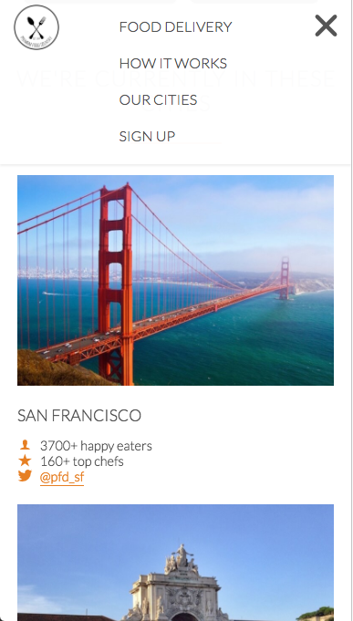
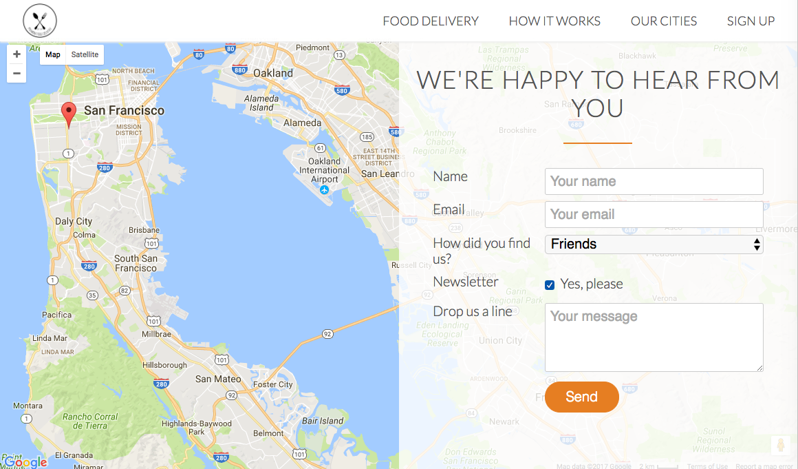

# Premium Food Delivery Site

Responsive site that uses CSS to implement animations as well as some javascript and jQuery to integrate Google Maps and scroll-on-click site behaviours.

[See this webpage at Github Pages](https://shern15.github.io/PremiumFoodDelivery/)

## Implementation

  

 
The [Responsive Grid System](http://www.responsivegridsystem.com/) is used to structure the general grid-layout of the site, with headers and content in each section being grouped into their own respective rows. This helps to modularize our site, so that each section is (with a few exceptions) basically just a "header" group and a "content" group.

The site is made responsive through the use of four media queries corresponding to different screen sizes in the range 0 - 1200px. The navigation links are collapsed into a dropdown list on screens with a width below 768px to maintain ease of use and readability.

The animation effects and transitions that occur up scrolling to the different sections are achieved using the [Animate.css](https://daneden.github.io/animate.css/) CSS library. [Waypoints](http://imakewebthings.com/waypoints/) is used to trigger the appropriate animations when users get to a particular section on the site.

The [gmaps.js](https://hpneo.github.io/gmaps/) library is used in conjunction with the [Google Maps APIs](https://developers.google.com/maps/) to make it easier to display and manipulate the map in the Feedback section with a few lines of code.

The feedback form is disabled as Github does not allow PHP in their Github Pages. Social and footer links do not lead away from the landing page as of now.

## Improvements

* Implement form submission using PHP
* Implement social and footer links.

## Libraries Used

### CSS
* [Responsive Grid System](http://www.responsivegridsystem.com/)
* [Normalize.css](https://necolas.github.io/normalize.css/)
* [Animate.css](https://daneden.github.io/animate.css/)
* [Ionicons](http://ionicons.com/)

### Javascript
* [jQuery](https://jquery.com/)
* [Respond](https://github.com/scottjehl/Respond) 
* [HTML5Shiv](https://github.com/aFarkas/html5shiv)
* [Selectivzr](http://selectivizr.com/)
* [gmaps.js](https://hpneo.github.io/gmaps/)
* [Waypoints](http://imakewebthings.com/waypoints/)

### Code Snippets

[Smooth Scrolling](https://css-tricks.com/snippets/jquery/smooth-scrolling/)
